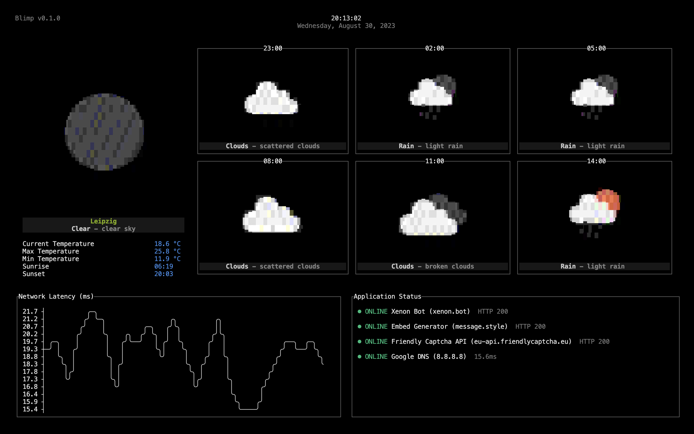
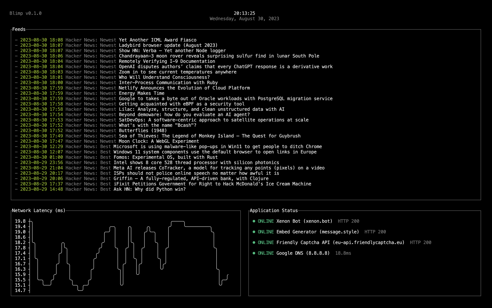

# Blimp

Customizable terminal UI for monitoring weather information, application status, network latency, and more

_I built this to run on a RaspberryPi Zero inside a Macintosh 1 on my shelf to quickly see weather and uptime info._



## Widgets

- **Weather**: Display current weather information and forecast
- **Network Latency**: Display a live chart of the network latency / ping
- **Application Status**: Monitor the status of web applications
- **RSS, Atom & JSON Feeds**: Display the most recent items from multiple feeds
- **Public transit next departures**: Display the next departures from public transit stations nearby
- **Random Quotes**: Display a random quote that changes periodically

## Installation

```shell
# Install from GitHub
go install github.com/merlinfuchs/blimp@latest
# Run blimp
blimp
```

## Configuration

The app will look for a configuration file called `blimp.toml`. Blimp comes with pretty good defaults but you can adjust everything how you want.

### Configure the widgets

```toml
[[widgets.status.targets]]
name = "Xenon Bot"
type = "https"
host = "xenon.bot"

[[widgets.status.targets]]
name = "Embed Generator"
type = "https"
host = "message.style"

[[widgets.status.targets]]
name = "Friendly Captcha API"
type = "https"
host = "eu-api.friendlycaptcha.eu"

[[widgets.status.targets]]
name = "Google DNS"
type = "ping"
host = "8.8.8.8"

[widgets.weather]
# You openweathermap.org API key
owm_api_key = ""
# The latitude and longitude of the weather location
owm_lat = 51.33
owm_lon = 12.37

[[widgets.feeds.targets]]
url = "https://hnrss.org/newest"

[widgets.transit]
# Your developer.here.com API key
here_api_key = ""
# The latitude and longitude of the location where blimp will look for the next public transit departures
here_lat = 51.33
here_lon = 12.37
# The search radius around the coordinates in meters
here_radius = 500
```

## Configure the layout

Blimp supports multiple pages that it switches between on an interval. Each page can have a distinct grid layout with different widgets. If you don't want blimp to switch between pages, only define one page.

```toml
# How fast do you want blimp to switch between pages
page_interval = 30000 # 30 seconds is the default

# Your first page
[[pages]]
layout = [
    ["weather", "weather"],
    ["weather", "weather"],
    ["latency", "status"]
]

# Your second page
[[pages]]
layout = [
    ["feeds", "feeds"],
    ["feeds", "feeds"],
    ["feeds", "feeds"],
    ["quotes", "status"]
]

# Your third page
[[pages]]
...
```

Look at the [default config](internal/config/default.config.toml) for other values you can override.

## Logging

Blimp will log errors and warning to STDERR. Because STDOUT is already used for the UI it can be hard to spot the errors.

To be able to see the log messages you can redirect the STDERR output to a file:

```shell
blimp 2>> blimp.log
```

## Configure the display

If you are running this on a low resolution display and aren't happy about the readability and looks, you might want to reconfigure the font and font-size of the terminal output.

For example on a raspberry pi you can run `sudo dpkg-reconfigure console-setup` to change the font and font-size. For my personal setup I have found TerminusBold wiht 12x24 to have looked the best.
