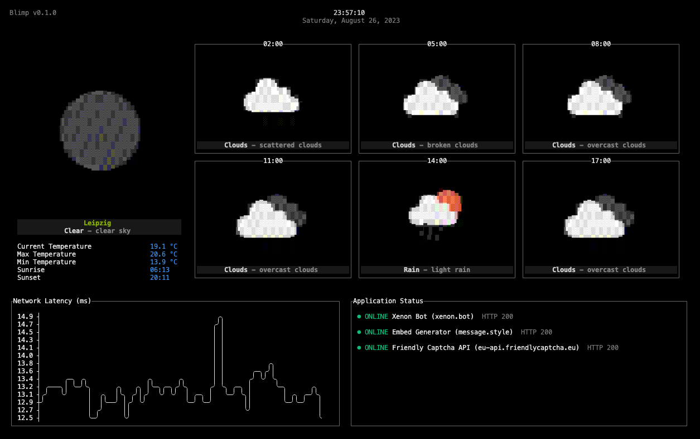

# Blimp

Customizable terminal UI for monitoring weather information, application status, network latency, and more

_I built this to run on a RaspberryPi Zero inside a Macintosh 1 on my shelf to quickly see weather and uptime info._



## Features

- **Weather**: Display current weather information and forecast
- **Network Latency**: Display a live chart of the network latency / ping
- **Application Status**: Monitor the status of web applications

## Installation

```shell
# Install from GitHub
go install github.com/merlinfuchs/blimp
# Run blimp
blimp
```

## Configuration

The app will look for a configuration file called `blimp.toml`. Blimp comes with pretty good defaults but you can adjust everything how you want.

### Configure the widgets

```toml
[[widgets.status.targets]]
name = "Xenon Bot"
type = "https"
host = "xenon.bot"

[[widgets.status.targets]]
name = "Embed Generator"
type = "https"
host = "message.style"

[[widgets.status.targets]]
name = "Friendly Captcha API"
type = "https"
host = "eu-api.friendlycaptcha.eu"

[[widgets.status.targets]]
name = "Google DNS"
type = "ping"
host = "8.8.8.8"

[widgets.weather]
# You openweathermap.org API key
owm_api_key = ""
# The latitude and longitude of the weather location
owm_lat = 51.33
owm_lon = 12.37

[[widgets.feeds.targets]]
url = "https://hnrss.org/newest"
```

## Configure the layout

Blimp supports multiple pages that it switches between on an interval. Each page can have a distinct grid layout with different widgets. If you don't want blimp to switch between pages, only define one page.

```toml
# How fast do you want blimp to switch between pages
page_interval = 30000 # 30 seconds is the default

# Your first page
[[pages]]
layout = [
    ["weather", "weather"],
    ["weather", "weather"],
    ["feeds", "feeds"],
    ["latency", "status"]
]

# Your second page
[[pages]]
layout = [
    ["feeds", "feeds"],
    ["feeds", "feeds"],
    ["feeds", "feeds"],
    ["latency", "status"]
]

# Your third page
[[pages]]
...
```

Look at the [default config](internal/config/default.config.toml) for other values you can override.

## Logging

Because logging to STDOUT is pointless because STDOUT is already used for the UI output, you can find log messages in a file called `blimp.log`.

If you want blimp to write to a different logfile you can set it in the config like this:

```toml
[logging]
filename = "blimp.log"
```
